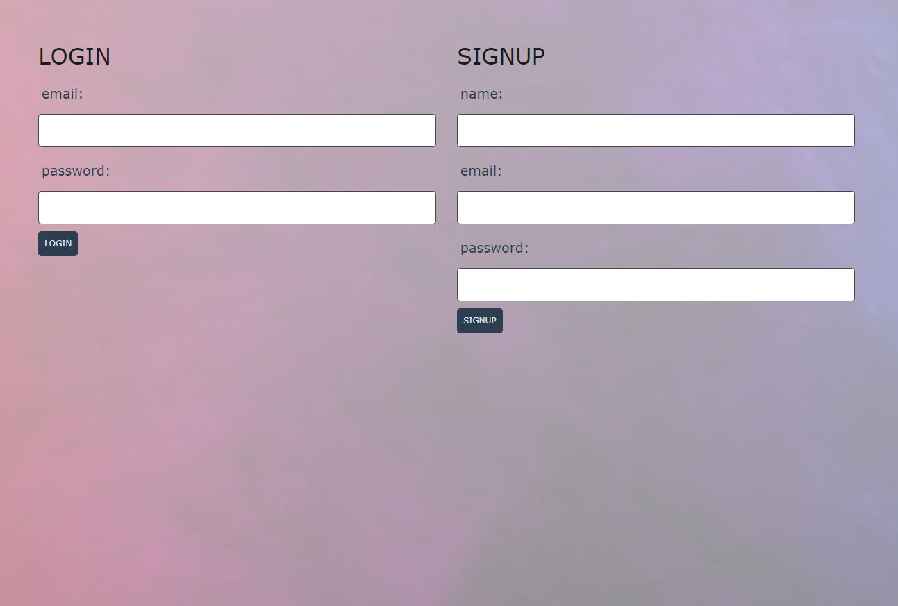
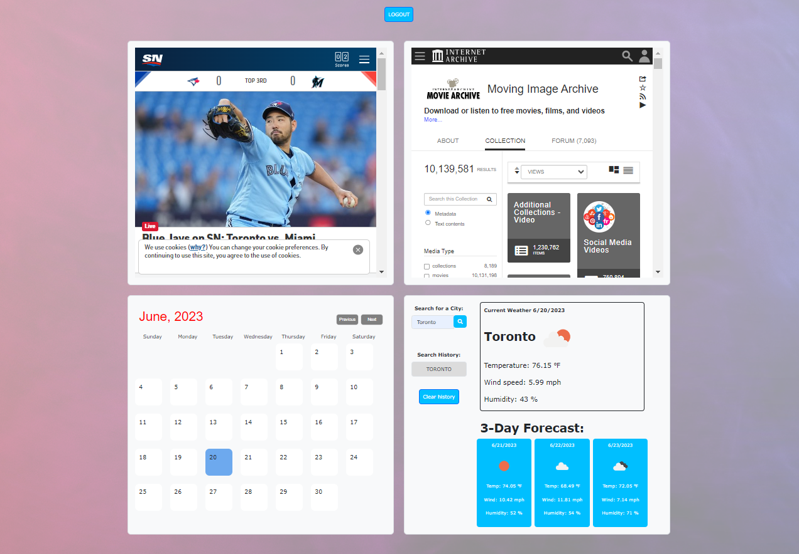

# WUPHF - MEDIA DASHBOARD

Our group created a Media Dashboard. The web application entails incorporating social media feeds which can be displayed. Landing page was created with the input for ‘sign up’ and incorporate it to handlebars. Initial thought was to feed Instagram and Twitter in the website but we had to drop the idea because of the difficulty engulfing around the permissions required. 

## Table of Contents
  * [Requirements](#requirements)   
  * [Screenshots](#screenshots)
  * [Developers](#developers)      
  * [Contributors](#contributors)  
  * [Links](#links)

## Requirements

* Use Node.js and Express.js to create a RESTful API.

* Use Handlebars.js as the templating engine.

* Use MySQL and the Sequelize ORM for the database.

* Have both GET and POST routes for retrieving and adding new data.

* Be deployed using Heroku (with data).

* Use at least one new library, package, or technology that we haven’t discussed.

* Have a polished UI.

* Be responsive.

* Be interactive (i.e., accept and respond to user input).

* Have a folder structure that meets the MVC paradigm.

* Include authentication (express-session and cookies).

* Protect API keys and sensitive information with environment variables.

* Have a clean repository that meets quality coding standards (file structure, naming conventions, follows best practices for class/id naming conventions, indentation, quality comments, etc.).

* Have a quality README (with unique name, description, technologies used, screenshot, and link to deployed application).

## Screenshots

- Landing Page

 - Media Dashboard

## Developers

* Marco Saverino: https://github.com/MarcoSaverino

* Renan Miranda: https://github.com/renansm93?tab=repositories

* Arun Kaushal: https://github.com/Arunkaushal84

* Jacob Garber: Github Profile

## Contributors

* Websites: W3schools, stackoverflow, & reddit
* Instructor(s): Ali Maqsood
* Assistant Instructor(s): Shihan, Adam, Krishna, Tareque Moatar
* Institution: University of Toronto

## Links

* Github Repo - https://github.com/MarcoSaverino/WUPHF-Media-Dashboard

* Deployed Website - https://sleepy-bayou-88957-e9d59341d888.herokuapp.com/